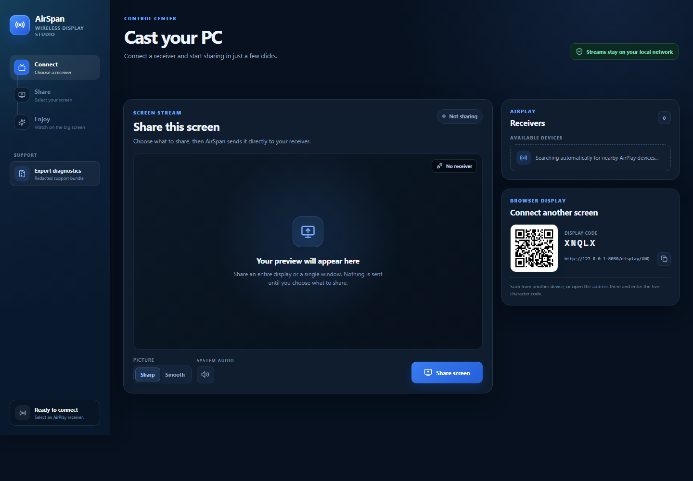
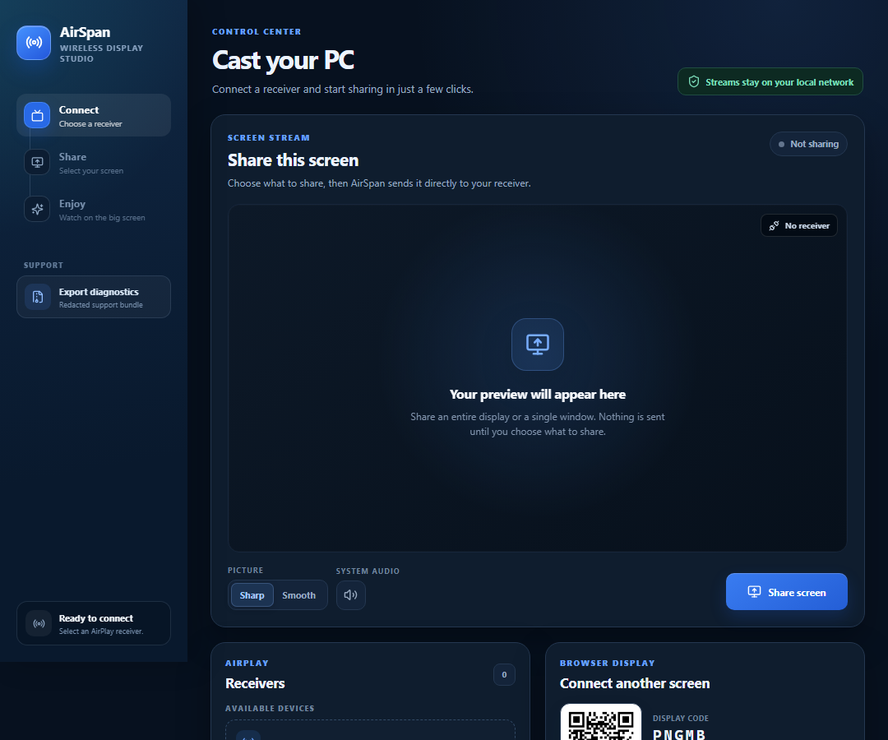

[README.md](https://github.com/user-attachments/files/32408462/README.md)
# AirSpan

<p align="center">
  
</p>

<p align="center">
  Stream your Windows desktop and system audio to compatible AirPlay receivers or another browser on your local network.
</p>

> [!IMPORTANT]
> AirSpan is an independent project and is not affiliated with, endorsed by, or sponsored by Apple Inc. AirPlay is a trademark of Apple Inc.

## Overview

AirSpan is a Windows desktop application for sharing a display or application window with a compatible receiver. It combines receiver discovery, PIN pairing, saved device credentials, H.264 video, system audio, browser-display sharing, and privacy-safe diagnostics in one dark control-center interface.



<details>
<summary>Compact layout</summary>



</details>

## Features

- Automatically discovers compatible AirPlay receivers on the local network
- PIN pairing and encrypted saved-pairing support
- Forget, disconnect, reconnect, and switch receiver controls
- H.264 desktop video streaming with Sharp and Smooth picture modes
- Windows system-audio streaming
- Entire-display or individual-window capture
- Browser-display pairing through a QR code or five-character room code
- Clear offline, pairing, connection, and streaming status messages
- Privacy-safe diagnostic ZIP exports that exclude pairing credentials and PINs
- Local-network operation for screen and audio traffic

## Requirements

- Windows 10 or Windows 11, x64
- A compatible AirPlay receiver, or another device with a modern browser
- The PC and receiver connected to the same local network
- A private-network firewall rule allowing AirSpan, when prompted by Windows

Receiver behavior varies by manufacturer and firmware. Apple TV and many AirPlay-compatible televisions are supported, but not every receiver implements the same parts of the protocol.

## Install AirSpan

1. Open the repository's [latest release](../../releases/latest).
2. Download **AirSpan Setup 1.0.1.exe**.
3. Run the installer and choose an installation folder.
4. Start AirSpan from the Start menu or desktop shortcut.

The portable release can be used without installation. Download **AirSpan-1.0.1-portable.exe** and run it from a folder where you have permission to write files.

### Windows SmartScreen warning

Current AirSpan builds are not code-signed. Windows SmartScreen may therefore display **Windows protected your PC** or identify the publisher as unknown. This warning does not necessarily mean the file is malicious; it means Windows cannot verify a signed publisher identity.

Only download AirSpan from this repository's official Releases page. Do not continue if the file came from another source or if you do not trust it. Code signing is planned for a future release.

## Stream to an AirPlay receiver

1. Open AirSpan and wait for the receiver to appear under **Receivers**.
2. Select the receiver.
3. If the receiver displays a PIN, enter it in AirSpan and submit it.
4. Choose **Sharp** or **Smooth** picture mode.
5. Turn system audio on or off before starting the stream.
6. Select **Share screen**, then choose a display or application window.
7. Select **Stop sharing** when finished. Use **Disconnect** to end the receiver session completely.

Use **Forget** to remove a saved pairing. The next connection will require a new receiver PIN when the receiver requests one.

Playback volume is controlled on the receiver itself.

## Connect a browser display

AirSpan can also send a display to another device with a modern browser:

1. Keep both devices on the same local network.
2. Scan the QR code shown under **Browser display**, or open the displayed address manually.
3. Enter the five-character display code when requested.
4. Leave the display page open while streaming.

## Diagnostics and privacy

The **Export diagnostics** button creates a ZIP for troubleshooting. It can include recent connection events, receiver model information, performance statistics, application details, and redacted logs.

The exporter is designed to exclude pairing credentials, PINs, cryptographic keys, network identifiers, and Windows user-profile paths. Device names and contextual error messages may remain, so review an exported archive before sharing it.

AirSpan does not automatically upload diagnostic archives. See [AirSpan-Privacy-Policy.txt](AirSpan-Privacy-Policy.txt) for additional details.

## Troubleshooting

### No receivers appear

- Confirm that the PC and receiver are on the same network.
- Make sure AirPlay is enabled on the receiver.
- Allow AirSpan on private networks in Windows Firewall.
- Restart AirSpan and the receiver if discovery remains unavailable.

### Video or audio stops

- Stop sharing, disconnect the receiver, reconnect, and begin a new stream.
- Try **Smooth** picture mode on older receivers or congested networks.
- Confirm that system audio was enabled before sharing began.
- Export diagnostics after reproducing the problem.

### Pairing does not complete

- Confirm that the current code shown by the receiver was entered.
- Use **Forget**, reconnect, and complete a fresh pairing.
- Restart AirSpan if the receiver retained an incomplete pairing session.

## Build from source

### Prerequisites

- Windows 10 or Windows 11, x64
- Node.js 22 or newer
- npm
- Go 1.27 or newer only when rebuilding the FairPlay helper

### Install and verify

```powershell
npm install
npm run typecheck
npm test
```

### Development server

```powershell
npm run dev
```

### Build the Windows releases

```powershell
npm run desktop:dist
```

The NSIS installer, portable executable, and unpacked application are written to `dist\`.

If PowerShell blocks `npm.ps1`, use `npm.cmd`:

```powershell
npm.cmd install
npm.cmd run desktop:dist
```

Additional build notes are available in [BUILD-WINDOWS.md](BUILD-WINDOWS.md).

## Security reports

Do not post pairing information, PINs, exported credentials, private network addresses, or unredacted personal data in a public issue. Exported diagnostic archives should still be reviewed before they are attached anywhere.

## License

AirSpan's original source code is available under the [MIT License](LICENSE).

Bundled libraries and the FairPlay helper retain their respective licenses. In particular, the FairPlay helper includes an LGPL-3.0-or-later dependency and is not relicensed under MIT. See [THIRD-PARTY-NOTICES.md](THIRD-PARTY-NOTICES.md) before redistributing a build.

